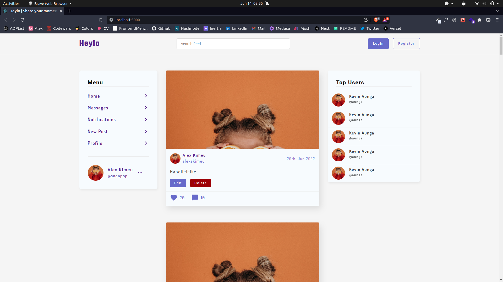
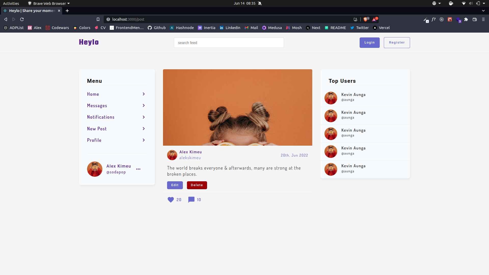
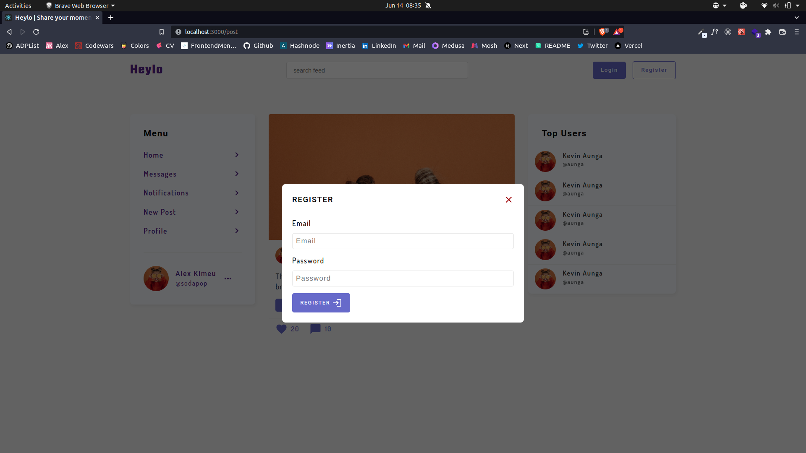
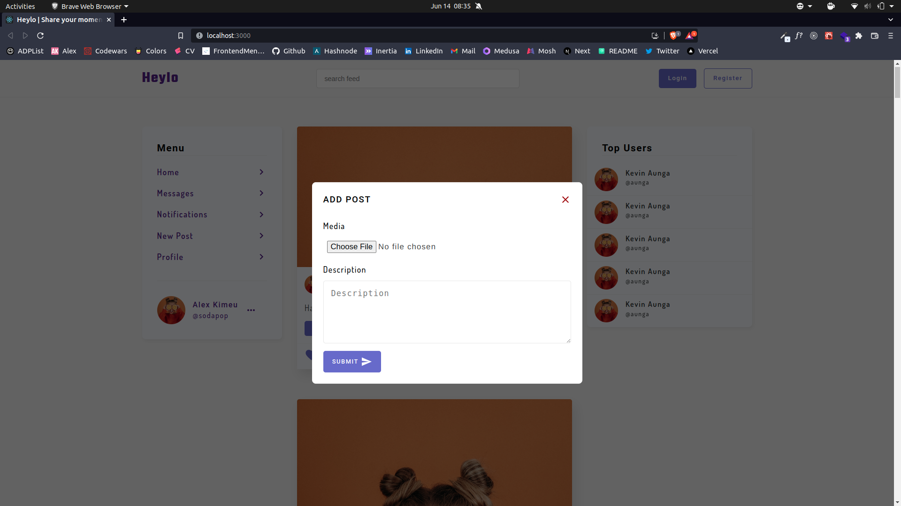
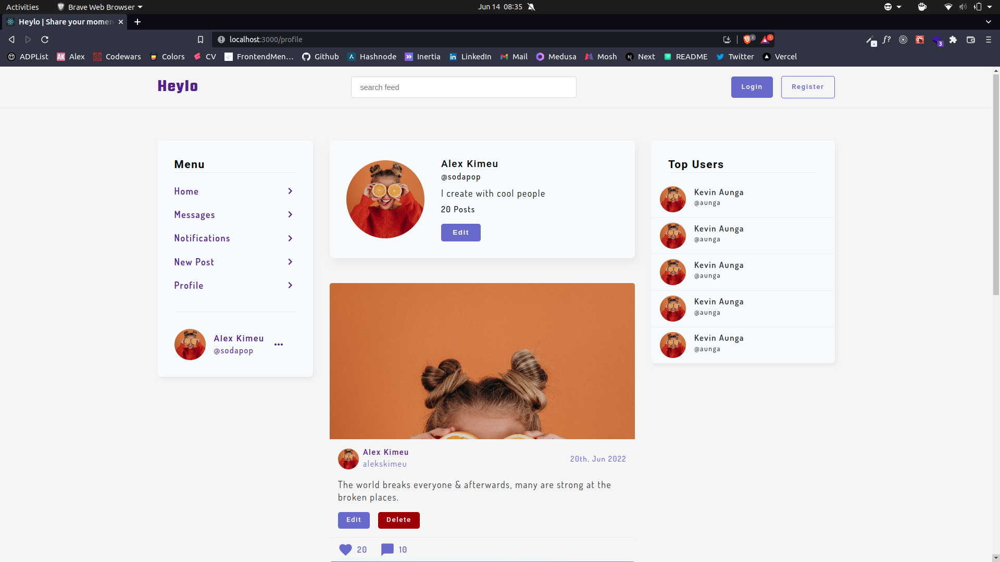

# Heylo 

Share your moments with the world. Heylo is a simple social mediaweb app that allows users share their moments in the form of media files. 


## Features

- User Authentication & authorization
- Users can upload media files
- Users can like & comment on other users' posts


## Tech Stack

**Client:** React, CSS3

**Server:** Firebase


## Screenshots

### Feeds page


### Single post page


### Register page


### Login page


### Create Feed page


### User Profile page


## Demo

Insert gif or link to demo


## Run Locally

Clone the project

```bash
  git clone https://github.com/alekskimeu/heylo.git
```

Go to the project directory

```bash
  cd heylo
```

Install dependencies

```bash
  npm install
```

Start the server

```bash
  npm start
```

## Authors

- [@alekskimeu](https://www.github.com/alekskimeu)


## 🔗 Links
[](https:/alex-kimeu.com/)
[](https://www.linkedin.com/in/alexkimeu)
[](https://twitter.com/alekskimeu)

## License

[MIT](https://choosealicense.com/licenses/mit/)
